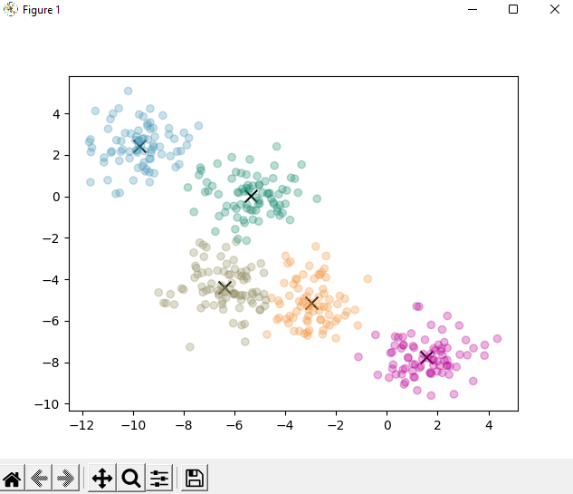

.. These are examples of badges you might want to add to your README:
   please update the URLs accordingly

    .. image:: https://api.cirrus-ci.com/github/<USER>/k_means.svg?branch=main
        :alt: Built Status
        :target: https://cirrus-ci.com/github/<USER>/k_means
    .. image:: https://readthedocs.org/projects/k_means/badge/?version=latest
        :alt: ReadTheDocs
        :target: https://k_means.readthedocs.io/en/stable/
    .. image:: https://img.shields.io/coveralls/github/<USER>/k_means/main.svg
        :alt: Coveralls
        :target: https://coveralls.io/r/<USER>/k_means
    .. image:: https://img.shields.io/pypi/v/k_means.svg
        :alt: PyPI-Server
        :target: https://pypi.org/project/k_means/
    .. image:: https://img.shields.io/conda/vn/conda-forge/k_means.svg
        :alt: Conda-Forge
        :target: https://anaconda.org/conda-forge/k_means
    .. image:: https://pepy.tech/badge/k_means/month
        :alt: Monthly Downloads
        :target: https://pepy.tech/project/k_means
    .. image:: https://img.shields.io/twitter/url/http/shields.io.svg?style=social&label=Twitter
        :alt: Twitter
        :target: https://twitter.com/k_means

.. image:: https://img.shields.io/badge/-PyScaffold-005CA0?logo=pyscaffold
    :alt: Project generated with PyScaffold
    :target: https://pyscaffold.org/

|

=======
k_means
=======

| Implementation of the K-means clustering algorithm from scratch with Python.
|

---------

=======
Authors
=======
- Krzysztof Król
- Mirosław Wiącek
- Wojciech Kastelik

---------

=========
Algorithm
=========
- choose the desired number of clusters - *n*
- initialize *n* clusters (random points from our dataset)
- assign each point to it's closest centroid
- compute the centroids for each cluster by taking the average of all the data points that belong to each cluster
- reassign points to new centroids and repeat the process given amount of times or untill centroids stop moving

All steps are implemented as standalone methods.

Integration of those methods takes places in the *pipeline* method that orchestrates the process.
It repeats the algorithm steps a given amount of times.

---------

=====
Tests
=====
We included unit and integration tests to validate the functionality of our implementation, as well as a performance test, comparing our implementation to that from the sklearn package

Unit/integration tests
=====

Launch those test from the 'src' directory using python -m pytest

- test_load_dataset() - test whether the dataset is loaded successfully, it returns the correct types and for a given test_dataset.xlsx file that it has appropriate length,
- test_initialize_centroids() - test if initialize_centroids returns a numpy array and that the number of centroids to be generated is actually the number of centroids returned,
- test_find_closest_centroids() - test that for 2 bounded clusters far away from each other, no data point has the incorrect centroid assigned,
- test_calc_new_centroids() - test that given random data points and random centroids, centroids move after an iteration (there is an extremely small chance of that not happening with random data)
- test_pipeline() - test that using the test_dataset.xlsx file, the centroids move after each iteration of the generator (higher number of iterations might cause this test to fail, as at some point the centroids will stabilize)

---------

=====
Usage
=====
There are two ways we acquire a dataset:
  - randomly generated clusters
  - dataset taken from a *.xlsx* file

If installed, our module allows to run pipeline with python from CLI.

| Install with:  "*pip install -e .*"

To see help, use:

windows:
   *py .\\src\\k_means\\clustering.py --help*
unix:
   *python3 ./src/k_means/clustering.py --help*

For example:
     | *py .\\src\\k_means\\clustering.py --plot -r 400 3*
     | plots 10 consecutive iterations of the algorithm on 400 randomly generated samples with 3 centroids.

---------

.. _pyscaffold-notes:

Note
====

This project has been set up using PyScaffold 4.1.1. 
